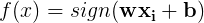
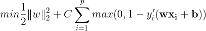
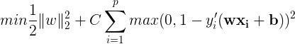

support-vector-machine
==

[]()
[]()

Support vector machine (SVM) was developed by Vapnik, and it has been used in many real-world applications, especially in cases of binary classification.
Its main objective is to find the optimal hyperplane that separates two classes in a given data _D_. The classification of data is accomplished using the decision function _f(x)_:




where `{-1,+1}` are the classes of given data. The learning parameters (weights `w`, and biases `b`) are obtained as the solution of the following optimization problem:


where `||w||_{2}` is the Euclidean norm (also known as the L2-norm), `\xi` is the cost function, and `C` is the penalty parameter (which may be an arbitrary value or a value obtained through hyper-parameter tuning). The corresponding unconstrained optimization problem is the following:



where `wx + b` is the function that returns the vector containing the scores for each classes (i.e. the predicted classes). The objective of the equation above is known as the primal form of L1-SVM, with the standard hinge loss. In this project, the L2-SVM variant of SVM was used as it is differentiable, and it provides a more stable result than the L1-SVM.



For this implementation, the SVM was written using Python and TensorFlow (as the machine intelligence library), and the problem tackled is a binary classification of breast cancer using the [Wisconsin diagnostic dataset](https://archive.ics.uci.edu/ml/datasets/Breast+Cancer+Wisconsin+(Diagnostic)).

The official dataset information states the following:

```
Features are computed from a digitized image of a fine needle aspirate (FNA) of a breast mass.
They describe the characteristics of the cell nuclei present in the image.
```

Its class distribution: 357 benign, and 212 malignant (total of 569 instances). In this implementation, the classes were `{-1, +1}`, representing the benign class and malignant class respectively.

The features included in the dataset are the following:

* radius
* texture
* perimeter
* area
* smoothness
* compactness
* concavity
* concave points
* symmetry
* fractal dimension

Each feature had its (1) mean, (2) standard error, and (3) "worst" or largest (mean of the three largest values) computed. Hence, the dataset having 30 features.

|Variable|Instances|Shape|
|--------|---------|-----|
|x (feature)|569|(569, 30)|
|y (label)|569|(569)|

## Pre-requisite

It is recommended that you have Python 3.x (specifically 3.5 or 3.6) installed in your system. Install the Python libraries specified in the following command to run the program.

```buildoutcfg
$ sudo pip3 install matplotlib sklearn tensorflow
```

You may opt to use `tensorflow-gpu` instead of `tensorflow`, it's entirely your choice.

## Usage

First, clone the project.
```
~$ git clone https://github.com/afagarap/support-vector-machine.git/
```

Program parameters.

```buildoutcfg
usage: main.py [-h] -c SVM_C -n NUM_EPOCHS -l LOG_PATH

SVM built using TensorFlow, for Wisconsin Breast Cancer Diagnostic Dataset

optional arguments:
  -h, --help            show this help message and exit

Arguments:
  -c SVM_C, --svm_c SVM_C
                        Penalty parameter C of the SVM
  -n NUM_EPOCHS, --num_epochs NUM_EPOCHS
                        number of epochs
  -l LOG_PATH, --log_path LOG_PATH
                        path where to save the TensorBoard logs
```

Then, go to its directory by using `cd`, and run the main program according to your desired parameters.
```
~$ cd support-vector-machine
~/support-vector-machine$ python3 main.py --svm_c 1 --num_epochs 1000 --log_path ./logs
```

## Sample Result

Training accuracy (graph above), and training loss (graph below).


Truncated training loss and training accuracy, with counts of true negative, false negative, true positive, and false positive.

```
step[0] train -- loss : 1310.61669921875, accuracy : 0.32500001788139343
step[100] train -- loss : 754.3006591796875, accuracy : 0.32500001788139343
step[200] train -- loss : 580.3919677734375, accuracy : 0.3499999940395355
...
step[10800] train -- loss : 5.456733226776123, accuracy : 1.0
step[10900] train -- loss : 6.086201190948486, accuracy : 0.9749999642372131
EOF -- training done at step 10999
Validation accuracy : 0.949999988079071
True negative : 12
False negative : 2
True positive : 26
False positive : 0
```

Confusion matrix on test data.


#### Standardized Dataset
The results above are based on a raw dataset from `sklearn`, i.e. `sklearn.datasets.load_breast_cancer().data`. Now, the following is a sample output based on a standardized dataset (using `sklearn.preprocessing.StandardScaler`):


Truncated training loss and training accuracy, with counts of true negative, false negative, true positive, and false positive.

```buildoutcfg
step[0] train -- loss : 86.02317810058594, accuracy : 0.44999998807907104
step[100] train -- loss : 49.41931915283203, accuracy : 0.6250000596046448
step[200] train -- loss : 41.406898498535156, accuracy : 0.925000011920929
...
step[10800] train -- loss : 2.045114040374756, accuracy : 1.0
step[10900] train -- loss : 6.896279335021973, accuracy : 0.9749999642372131
EOF -- training done at step 10999
Validation accuracy : 0.9750000238418579
True negative : 16
False negative : 0
True positive : 23
False positive : 1
```

Confusion matrix on the standardized test data.


## License

```buildoutcfg
   Copyright 2017 Abien Fred Agarap

   Licensed under the Apache License, Version 2.0 (the "License");
   you may not use this file except in compliance with the License.
   You may obtain a copy of the License at

       http://www.apache.org/licenses/LICENSE-2.0

   Unless required by applicable law or agreed to in writing, software
   distributed under the License is distributed on an "AS IS" BASIS,
   WITHOUT WARRANTIES OR CONDITIONS OF ANY KIND, either express or implied.
   See the License for the specific language governing permissions and
   limitations under the License.

```